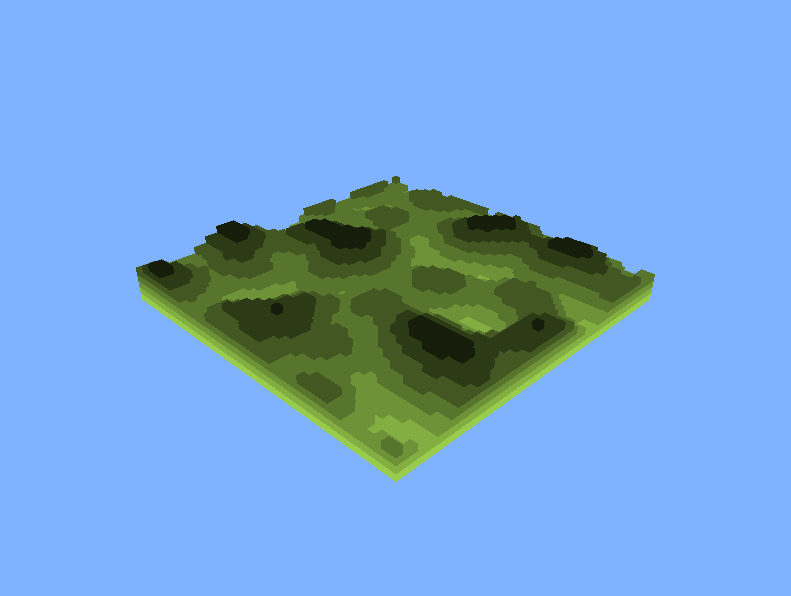
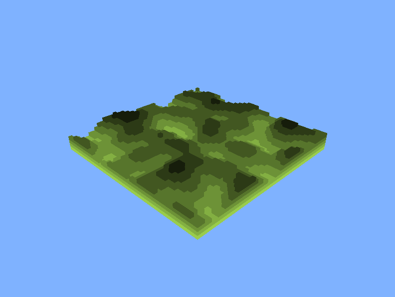

# Projekt Leírás

Ez a projekt egy 3D terep renderelésére épül, ahol a magasságot Perlin zaj generálja. Az OpenGL segítségével megjelenítjük a generált terepet, és lehetőséget biztosítunk a kamera mozgatására is. A fő hangsúly a `perlin.py` fájlban található Perlin zaj algoritmuson van, amely a terrain (terep) generálásához szükséges magasságadatokat biztosít.

## `app.py` Leírása

Az `app.py` fájl az OpenGL alapú grafikus alkalmazás indító kódját tartalmazza. A főbb elemek:

### Ablakbeállítások és Terepparaméterek
- **_width, _height**: Az ablak mérete (800x600).
- **_terrain_size**: A terep mérete (50x50 kocka).
- **_scale**: A zaj skálázása (10.0).

### Kamera Paraméterek
- **_angle_x, _angle_y**: A kamera szögének beállítása (45° és 30°).
- **_distance**: A kamera távolsága a tereptől (100 egység).

### Magasságtérkép Generálása
A `generate_heightmap()` függvény a Perlin zajt használva generál egy 2D-es tömböt, amely a terep magasságát tárolja. A Perlin zaj `perlin.noise(nx, ny)` függvénnyel van kiszámítva, amely a térkép egyes pontjainak magasságát állítja be.

### Terep Megjelenítése
A `_draw_terrain()` függvény felelős a terep megjelenítéséért, ahol a magasságok szerint kockák vannak felhalmozva. A kockák színei a magasság alapján sötétednek.

### Kamera Kezelése
A kamera az `gluLookAt()` függvénnyel van beállítva. A `_keyboard()` függvény lehetőséget biztosít arra, hogy a `w`, `a`, `s`, `d` billentyűkkel módosíthassuk a kamera szögét, lehetővé téve a körbeforgást.

### OpenGL Inicializálás
Az OpenGL beállítások az `_init()` függvényben találhatóak. A háttérszín az égkék (`glClearColor(0.5, 0.7, 1.0, 1.0)`).

---

## `perlin.py` Leírása

A `perlin.py` a Perlin zaj algoritmus implementációját tartalmazza, amely 2D-es zajt generál a terep magasságainak előállításához. Az alábbi függvények találhatók benne:

### `noise(x, y)`
Ez a fő függvény, amely kiszámítja a 2D Perlin zaj értéket az `(x, y)` koordinátákhoz. A függvény az alábbi lépéseket hajtja végre:
1. **Rács pontok meghatározása**: Az `(x, y)` koordináta körüli egész számú rács pontokat számolja ki (`x0, x1, y0, y1`).
2. **Helyi koordináták meghatározása**: A bemeneti koordináták rácspontra vonatkozó eltérése (`sx`, `sy`) számítása.
3. **Gradiensek generálása**: A `gradient()` függvény segítségével meghatározza a rács pontokhoz tartozó pseudo-random irányokat.
4. **Bilináris interpoláció**: A pontok közötti interpoláció a lineáris interpoláció (`lerp()`) és a Perlin fade függvény segítségével történik.

### `lerp(a, b, t)`
A lineáris interpoláció függvénye, amely az `a` és `b` értékek közötti interpolációt számítja ki `t` súlyozott arányában.

### `fade(t)`
A fade függvény a Perlin zaj klasszikus fade görbéjét valósítja meg: `6t^5 - 15t^4 + 10t^3`, amely a sima átmeneteket biztosítja az interpolációban.

### `gradient(ix, iy)`
Ez a függvény egy determinisztikus véletlenszerű irányvektort generál az `(ix, iy)` koordináták alapján, amit a Perlin zaj számításokhoz használunk.

---

