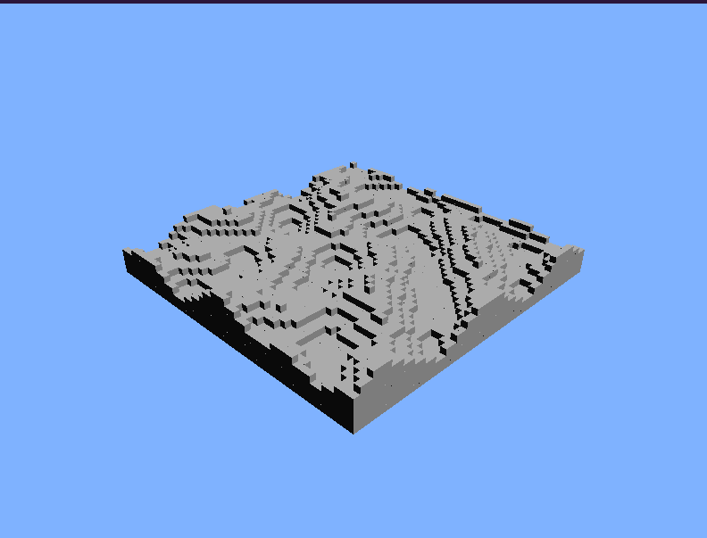

# Projekt Leírás

Ez a projekt egy 3D terep renderelésére épül, ahol a magasságot Perlin zaj generálja. Az OpenGL segítségével megjelenítjük a generált terepet, és lehetőséget biztosítunk a kamera mozgatására is. A fő hangsúly a `perlin.py` fájlban található Perlin zaj algoritmuson van, amely a terrain (terep) generálásához szükséges magasságadatokat biztosít.

## `app.py` Leírása

Az `app.py` fájl az OpenGL alapú grafikus alkalmazás indító kódját tartalmazza. A főbb elemek:

### Ablakbeállítások és Terepparaméterek
- **_width, _height**: Az ablak mérete (800x600).
- **_terrain_size**: A terep mérete (50x50 kocka).
- **_scale**: A zaj skálázása (10.0).

### Kamera Paraméterek
- **_angle_x, _angle_y**: A kamera szögének beállítása (45° és 30°).
- **_distance**: A kamera távolsága a tereptől (100 egység).

#### `_generate_heightmap(_seed_x, _seed_y, _fade_a, _fade_b, _fade_c)`
Magasságtérképet generál Perlin zaj segítségével.

- **Bemeneti paraméterek**:
  - **`_seed_x`** *(int)*: Az x irányú gradiens generálásához használt seed szorzó.
  - **`_seed_y`** *(int)*: Az y irányú gradiens generálásához használt seed szorzó.
  - **`_fade_a`** *(int)*: A fade függvény `a` együtthatója.
  - **`_fade_b`** *(int)*: A fade függvény `b` együtthatója.
  - **`_fade_c`** *(int)*: A fade függvény `c` együtthatója.
- **Visszatérési érték**: Egy 2D `numpy.ndarray`, amely a terep magasságait tartalmazza.

#### `_smooth_heightmap(heightmap)`
Egyszerű átlagoló szűrőt alkalmaz a magasságtérképen a simább megjelenés érdekében.

- **Bemeneti paraméterek**:
  - **`heightmap`** *(numpy.ndarray)*: A magasságtérkép, amelyet simítani kell.
- **Visszatérési érték**: Egy simított magasságtérkép (`numpy.ndarray`).

#### `_draw_cube(x, y, z)`
Egy kockát rajzol az adott koordinátákon.

- **Bemeneti paraméterek**:
  - **`x`** *(float)*: A kocka x-koordinátája.
  - **`y`** *(float)*: A kocka y-koordinátája.
  - **`z`** *(float)*: A kocka z-koordinátája.

#### `_draw_terrain()`
A magasságtérkép alapján megrajzolja a terepet kockákból.

- **Leírás**: A magasságok szerint kockákat halmoz fel, és a magasság alapján árnyalja őket.

#### `_init_lighting()`
Inicializálja a világítást az OpenGL-ben.

- **Leírás**: Engedélyezi a világítást és beállítja az első fényforrást (pozíció, diffúz és spekuláris fény).

#### `_apply_shading()`
Simított árnyalást alkalmaz az objektumokra.

- **Leírás**: Beállítja az OpenGL árnyalási modelljét Phong árnyalásra (`GL_SMOOTH`).

#### `_display()`
A megjelenítésért felelős callback függvény.

- **Leírás**: Törli a képernyőt, beállítja a kamerát, és megjeleníti a terepet.

#### `_reshape(w, h)`
Az ablak átméretezésekor hívódik meg.

- **Bemeneti paraméterek**:
  - **`w`** *(int)*: Az ablak új szélessége.
  - **`h`** *(int)*: Az ablak új magassága.

#### `_keyboard(key, x, y)`
A billentyűzetes vezérlésért felelős callback függvény.

- **Bemeneti paraméterek**:
  - **`key`** *(bytes)*: A lenyomott billentyű.
  - **`x`**, **`y`** *(int)*: Az egér pozíciója a lenyomáskor.

#### `_init()`
Inicializálja az OpenGL beállításokat.

- **Leírás**: Engedélyezi a mélységi tesztet, beállítja a háttérszínt, és inicializálja a világítást és árnyalást.

#### `main(fade_a, fade_b, fade_c, seed_x, seed_y)`
A program belépési pontja.

- **Bemeneti paraméterek**:
  - **`fade_a`** *(int)*: A fade függvény `a` együtthatója.
  - **`fade_b`** *(int)*: A fade függvény `b` együtthatója.
  - **`fade_c`** *(int)*: A fade függvény `c` együtthatója.
  - **`seed_x`** *(int)*: Az x irányú gradiens generálásához használt seed szorzó.
  - **`seed_y`** *(int)*: Az y irányú gradiens generálásához használt seed szorzó.
- **Leírás**: Inicializálja a magasságtérképet, alkalmazza a simítást, és elindítja az OpenGL fő ciklusát.

---

## `perlin.py` Leírása

A `perlin.py` a Perlin zaj algoritmus implementációját tartalmazza, amely 2D-es zajt generál a terep magasságainak előállításához. Az alábbi függvények találhatók benne:

### `noise(x, y, seed_x, seed_y, fade_a, fade_b, fade_c)`
Ez a fő függvény, amely kiszámítja a 2D Perlin zaj értéket az `(x, y)` koordinátákhoz. A függvény az alábbi lépéseket hajtja végre:
1. **Rács pontok meghatározása**: Az `(x, y)` koordináta körüli egész számú rács pontokat számolja ki (`x0, x1, y0, y1`).
2. **Helyi koordináták meghatározása**: A bemeneti koordináták rácspontra vonatkozó eltérése (`sx`, `sy`) számítása.
3. **Gradiensek generálása**: A `gradient()` függvény segítségével meghatározza a rács pontokhoz tartozó pseudo-random irányokat.
4. **Bilináris interpoláció**: A pontok közötti interpoláció a lineáris interpoláció (`lerp()`) és a Perlin fade függvény segítségével történik.

#### Bemeneti paraméterek:
- **`x`** *(float)*: Az x-koordináta, amelyhez a Perlin zaj értékét számítjuk.
- **`y`** *(float)*: Az y-koordináta, amelyhez a Perlin zaj értékét számítjuk.
- **`seed_x`** *(int)*: Az x irányú gradiens generálásához használt seed szorzó.
- **`seed_y`** *(int)*: Az y irányú gradiens generálásához használt seed szorzó.
- **`fade_a`** *(int)*: A fade függvény `a` együtthatója.
- **`fade_b`** *(int)*: A fade függvény `b` együtthatója.
- **`fade_c`** *(int)*: A fade függvény `c` együtthatója.

### `lerp(a, b, t)`
A lineáris interpoláció függvénye, amely az `a` és `b` értékek közötti interpolációt számítja ki `t` súlyozott arányában.

#### Bemeneti paraméterek:
- **`a`** *(float)*: Az interpoláció kezdőértéke.
- **`b`** *(float)*: Az interpoláció végértéke.
- **`t`** *(float)*: Az interpoláció súlyozási tényezője (0 és 1 között).

### `fade(t, fade_a, fade_b, fade_c)`
A fade függvény a Perlin zaj klasszikus fade görbéjét valósítja meg: `fade_a * t^5 - fade_b * t^4 + fade_c * t^3`, amely a sima átmeneteket biztosítja az interpolációban.

#### Bemeneti paraméterek:
- **`t`** *(float)*: Az érték, amelyre a fade görbét alkalmazzuk (0 és 1 között).
- **`fade_a`** *(int)*: A fade függvény `a` együtthatója.
- **`fade_b`** *(int)*: A fade függvény `b` együtthatója.
- **`fade_c`** *(int)*: A fade függvény `c` együtthatója.

### `gradient(ix, iy, seed_x, seed_y)`
Ez a függvény egy determinisztikus véletlenszerű irányvektort generál az `(ix, iy)` koordináták alapján, amit a Perlin zaj számításokhoz használunk.

#### Bemeneti paraméterek:
- **`ix`** *(int)*: Az x-koordináta rácspont indexe.
- **`iy`** *(int)*: Az y-koordináta rácspont indexe.
- **`seed_x`** *(int)*: Az x irányú gradiens generálásához használt seed szorzó.
- **`seed_y`** *(int)*: Az y irányú gradiens generálásához használt seed szorzó.

---

